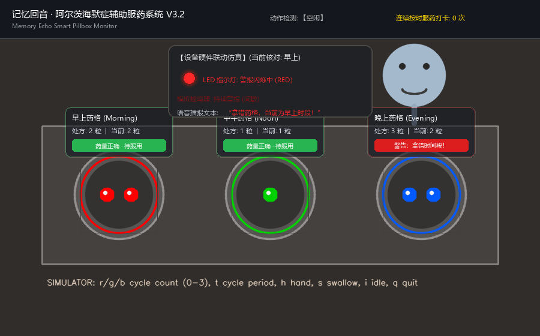

# Smart Pillbox: Memory Echo Vision Prototype

阿尔茨海默症长者辅助服药的智能药盒视觉识别原型。项目通过 OpenCV/Pillow 构建可交互演示界面，并把药丸视觉检测、服药动作模拟、时间段防错药、处方剂量核对和声光语音反馈串成一套完整流程。



## 功能亮点

- 药格视觉识别：检测早上、中午、晚上三个药格是否有药，并统计药丸数量。
- 处方剂量校验：每个时段可设置预期药量，装药数量不符时提示 `WRONG DOSAGE`。
- 防错药机制：非当前时段药格被取药时触发严重警报。
- 吞咽确认：用键盘模拟 `hand_to_mouth` / `swallow` / `idle` 动作，验证服药闭环。
- 多检测后端：支持本地 OpenCV、电脑端本地 YOLO、Roboflow 云端 YOLO。
- 轻量设备预留：业务层统一使用 `SlotVisionResult`，后续可把 FOMO 检测结果转换成同一结构接入。

## 文件结构

```text
.
├── smart_pillbox_opencv.py      # 主程序
├── assets/
│   └── demo_snapshot_v3_2.png   # 演示截图
├── docs/
│   ├── demo3.0.md               # 版本升级说明
│   └── implementation_plan.md   # 实施计划
├── requirements.txt
└── .gitignore
```

## 环境安装

建议使用 Python 3.10+。

```bash
python -m venv .venv

# Windows PowerShell
.\.venv\Scripts\Activate.ps1

pip install -r requirements.txt
```

## 快速运行

默认会尝试打开摄像头；如果没有摄像头，会自动切换到模拟器。

```bash
python smart_pillbox_opencv.py
```

强制使用模拟器：

```bash
python smart_pillbox_opencv.py --no-camera
```

保存一张演示截图：

```bash
python smart_pillbox_opencv.py --snapshot outputs/demo.png
```

## 交互按键

- `r`：循环切换早上药格药片数，`0 -> 1 -> 2 -> 3 -> 0`
- `g`：循环切换中午药格药片数
- `b`：循环切换晚上药格药片数
- `t`：切换当前服药时段，`Morning -> Noon -> Evening`
- `h`：模拟手部送药入口动作
- `s`：模拟喝水吞咽动作
- `i`：恢复空闲动作
- `q`：退出程序

摄像头画面默认会水平镜像，方便现场演示。如果要关闭镜像：

```bash
python smart_pillbox_opencv.py --no-camera-mirror
```

## 检测后端

### 1. OpenCV 本地检测

默认模式，适合课堂演示和无网络环境：

```bash
python smart_pillbox_opencv.py --detector opencv
```

### 2. 本地 YOLO 检测

电脑端部署时可使用从 Roboflow/Ultralytics 导出的药丸检测权重，例如 `best.pt`：

```bash
python smart_pillbox_opencv.py --detector yolo --yolo-model best.pt
```

注意：通用 `yolo11n.pt` / `yolo26n.pt` 是 COCO 预训练权重，类别是 person、car、sports ball 等，不是药丸模型。程序会过滤非药丸类别，避免误报。请使用药丸数据集训练或导出的专用权重。

### 3. Roboflow 云端 YOLO 检测

可对接 Roboflow Universe 上的 `pill-detection-fnftd/3` 模型：

```bash
set ROBOFLOW_API_KEY=your_api_key
python smart_pillbox_opencv.py --detector roboflow
```

PowerShell 写法：

```powershell
$env:ROBOFLOW_API_KEY="your_api_key"
python smart_pillbox_opencv.py --detector roboflow
```

## YOLO 与 FOMO 的项目定位

当前电脑端原型推荐使用 YOLO：它可以返回每粒药的检测框、置信度和粗类别，适合药片计数与胶囊/片剂识别。

如果未来迁移到轻量设备，可以使用同一类药片数据重新训练 FOMO 模型。FOMO 更适合低功耗设备，重点输出药片区域或中心点，再转换为本项目统一的 `SlotVisionResult`：

```python
present
pill_count
confidence
class_counts
roi
```

这样业务逻辑不依赖具体模型，防错药、剂量校验、吞咽确认和硬件反馈都可以保持不变。

## 免责声明

本项目是课程作业与原型演示，不可作为真实医疗诊断或用药决策系统。真实使用前需要经过专业数据采集、模型验证、隐私合规与医疗安全评估。

## Frontend Mobile App Demo

The `frontend/` directory contains the caregiver-facing mobile monitoring demo exported from Figma Make. It is a Vite + React prototype for viewing pillbox status, live monitoring, medication history, alerts, and settings.

Run the frontend demo:

```bash
cd frontend
npm install
npm run dev
```

If you use pnpm:

```bash
cd frontend
pnpm install
pnpm dev
```

Suggested full-system story for presentation:

```text
Python OpenCV / YOLO smart pillbox backend
        -> pill count, slot status, alerts, swallow events
        -> future API layer such as Flask or FastAPI
        -> frontend mobile caregiver dashboard
```

The current frontend is a visual and interaction prototype. It does not yet call the Python camera program directly.

## Roboflow SDK Integration Note

The Roboflow detector uses the official `inference-sdk` client:

```python
from inference_sdk import InferenceHTTPClient

client = InferenceHTTPClient(
    api_url="https://serverless.roboflow.com",
    api_key=os.getenv("ROBOFLOW_API_KEY"),
)
result = client.infer("YOUR_IMAGE.jpg", model_id="pill-detection-fnftd/3")
```

Do not hard-code the Roboflow API key in source code. Set it before running:

```powershell
$env:ROBOFLOW_API_KEY="your_api_key"
python smart_pillbox_opencv.py --detector roboflow
```
