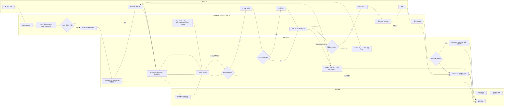

# Smart Pillbox V4 Flowchart

```mermaid
flowchart LR
    subgraph Elder["老人行为"]
        E1["老人靠近药盒"]
        E2["打开某个药格"]
        E3["拿起药丸"]
        E4["手部送药入口"]
        E5["吞咽"]
        E6["关闭药格 / 纠正操作"]
    end

    subgraph Vision["视觉感知层: YOLO + OpenCV"]
        V1["Camera frame"]
        V2["YOLO 检测药丸 bbox / class / confidence"]
        V3{"YOLO 置信度足够?"}
        V4["OpenCV Slot Mapping: bbox -> Morning / Noon / Evening"]
        V5["检测 pill_count 是否变化"]
        V6["检测 hand_to_mouth"]
        V7["检测 swallow"]
        V8["低置信度 / 摄像头遮挡"]
    end

    subgraph Safety["安全状态机"]
        S1["MONITORING"]
        S2{"是否到服药时间?"}
        S3{"打开药格是否正确?"}
        S4{"剂量是否匹配处方?"}
        S5{"动作闭环是否完整?"}
        S6["NORMAL_SUCCESS: 记录服药成功"]
        S7["REMINDER: 提醒到点服药"]
        S8["WARNING_DOSAGE: 剂量异常"]
        S9["LOCKED_WRONG_SLOT: 错误药格锁定"]
        S10["UNCERTAIN: 暂停判定并提示调整摄像头"]
        S11["RECOVERY: 放回药丸 / 人工确认后恢复"]
    end

    subgraph Family["家属监控"]
        F1["上传服药记录"]
        F2["查看服药状态"]
        F3["异常通知"]
        F4["家属确认 / 远程提醒"]
    end

    E1 --> V1 --> V2 --> V3
    V3 -->|No| V8 --> S10 --> F3
    V3 -->|Yes| V4 --> S1
    S1 --> S2
    S2 -->|No, 还未到时间| S1
    S2 -->|No, 已超时| S7 --> F3
    S2 -->|Yes| E2 --> S3
    S3 -->|No| V5
    V5 -->|错误药格有药丸移动| S9 --> F3
    V5 -->|无移动| S7
    S3 -->|Yes| E3 --> V5 --> S4
    S4 -->|No| S8 --> F3
    S4 -->|Yes| E4 --> V6 --> E5 --> V7 --> S5
    S5 -->|No| S7
    S5 -->|Yes| S6 --> F1 --> F2
    S8 --> E6 --> S11 --> S1
    S9 --> E6 --> S11 --> F4 --> S1
    S10 --> E6 --> S11 --> S1
```

