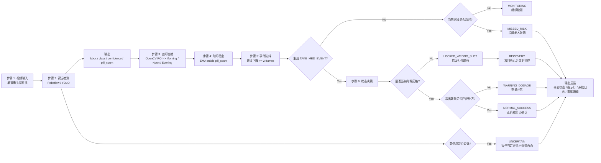

# Smart Pillbox V4 Flowchart

## No Swallow Version

```mermaid
flowchart LR
    A["步骤 1: 视频输入<br/>单摄像头实时流"] --> B["步骤 2: 视觉检测<br/>Roboflow / YOLO"]
    B --> C["输出<br/>bbox / class / confidence / pill_count"]
    C --> D["步骤 3: 空间映射<br/>OpenCV ROI -> Morning / Noon / Evening"]
    D --> E["步骤 4: 时间稳定<br/>EMA stable pill_count"]
    E --> F["步骤 5: 事件防抖<br/>连续下降 >= 2 frames"]
    F --> G{"生成 TAKE_MED_EVENT?"}
    G -->|No| H{"当前时段是否超时?"}
    H -->|No| I["MONITORING<br/>继续检测"]
    H -->|Yes| J["MISSED_RISK<br/>提醒老人取药"]
    G -->|Yes| K["步骤 6: 状态决策"]
    K --> L{"是否当前时段药格?"}
    L -->|No| M["LOCKED_WRONG_SLOT<br/>错误孔位取药"]
    L -->|Yes| N{"取出数量是否匹配处方?"}
    N -->|No| O["WARNING_DOSAGE<br/>剂量异常"]
    N -->|Yes| P["NORMAL_SUCCESS<br/>正确取药已确认"]
    B --> Q{"置信度是否过低?"}
    Q -->|Yes| R["UNCERTAIN<br/>暂停判定并提示调整画面"]
    M --> S["RECOVERY<br/>放回药丸后恢复监控"]
    O --> T["输出反馈<br/>界面状态 / 指示灯 / 系统日志 / 家属通知"]
    J --> T
    P --> T
    R --> T
    S --> T
```
