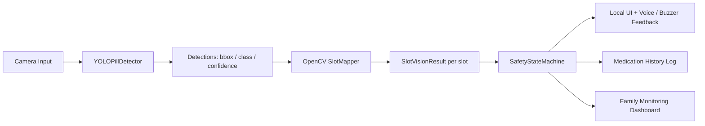
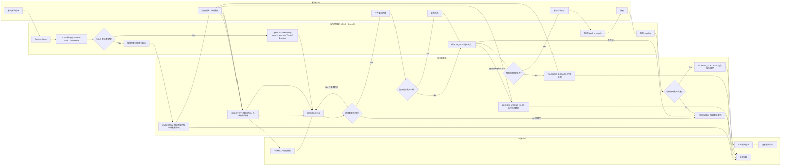

# Smart Pillbox V4 Upgrade Spec

## YOLO + OpenCV Hybrid + Safety State Machine

本版本目标不是做一个单纯的药丸识别 demo，而是把项目升级为一个可解释、可训练、可演示的智能服药安全系统：

```text
YOLO = AI perception layer
OpenCV = spatial mapping and validation layer
State Machine = medication safety layer
Frontend / family view = monitoring and notification layer
```

核心原则：

- YOLO 负责学习型视觉感知：识别药丸，输出 bbox、class、confidence。
- OpenCV 负责药盒结构约束：把检测结果映射到 Morning / Noon / Evening 药格，并验证药丸数量变化。
- 状态机负责安全判断：只有在正确时段、正确药格、正确剂量、动作闭环都成立时，才记录服药成功。
- 家属端负责远程查看和异常通知：不是替代本地安全逻辑，而是作为监护闭环。

---

## 1. Recommended System Architecture



### Module Responsibilities

| Module | Responsibility | Output |
|---|---|---|
| `YOLOPillDetector` | 药丸检测，支持训练权重接入 | `Detection[]` |
| `OpenCVSlotMapper` | bbox 到药格 ROI 的空间映射 | 每个药格的 `pill_count` / `confidence` |
| `ActionDetector` | 手部送药、吞咽动作识别或键盘模拟 | `idle` / `hand_to_mouth` / `swallow` |
| `MedicationTracker` | 记录药格变化、剂量、服药确认 | `SlotFeedback` / events |
| `SafetyStateMachine` | 正常、警告、锁定、恢复状态控制 | `system_state` |
| `FamilyNotifier` | 上传记录、异常通知 | history / alert |

---

## 2. Improved User Flow

下面是建议替换原图的完整泳道式流程。它把老人行为、AI 感知、状态机、家属监控拆开，答辩时更容易解释。



---

## 3. Success Criteria

不能只因为药丸减少就记录成功。建议代码里把“成功服药”定义为：

```text
current_slot == expected_slot
AND pill_count decreased
AND taken_count == expected_count
AND hand_to_mouth detected
AND swallow detected within time window
AND detector_confidence >= confidence_threshold
```

只有全部成立，才能：

- UI 显示 `CONFIRMED: TAKEN`
- 写入 history log
- 家属端显示完成
- 增加 streak

如果任何条件不成立，应进入 `REMINDER`、`WARNING_DOSAGE`、`LOCKED_WRONG_SLOT` 或 `UNCERTAIN`。

---

## 4. Safety States

建议把系统状态从零散 if 判断升级为明确状态机。

```text
IDLE
  -> MONITORING
  -> REMINDER
  -> NORMAL_IN_PROGRESS
  -> NORMAL_SUCCESS
  -> WARNING_DOSAGE
  -> LOCKED_WRONG_SLOT
  -> UNCERTAIN
  -> RECOVERY
  -> MONITORING
```

### State Definition

| State | Trigger | UI / System Behavior |
|---|---|---|
| `IDLE` | 系统启动或无人靠近 | 保持监控 |
| `MONITORING` | 摄像头正常，等待服药 | 显示当前时段和药格状态 |
| `REMINDER` | 到点未服药，或动作闭环不完整 | 提示“请服药”，可轻量提醒家属 |
| `NORMAL_IN_PROGRESS` | 正确药格药量减少 | 等待动作识别和吞咽确认 |
| `NORMAL_SUCCESS` | 完整成功条件成立 | 记录成功服药 |
| `WARNING_DOSAGE` | 正确药格但数量不匹配 | 橙色警告，不记录成功 |
| `LOCKED_WRONG_SLOT` | 错误药格发生药丸移动 | 红色锁定，声音报警，阻断成功记录 |
| `UNCERTAIN` | YOLO 低置信度、摄像头遮挡、画面异常 | 暂停判定，提示调整 |
| `RECOVERY` | 老人放回药丸或家属确认 | 清除锁定并恢复监控 |

---

## 5. Error Scenarios To Add

### Case A: 打开错误药格，但未取药

```text
opened_slot != current_period
AND pill_count unchanged
=> REMINDER / gentle warning
```

不要立即红色锁定。提示老人关闭错误药格即可。

### Case B: 打开错误药格，并检测到药丸移动

```text
opened_slot != current_period
AND pill_count decreased
=> LOCKED_WRONG_SLOT
```

行为：

- UI 红色锁定
- 声音提示“当前不是该药格服药时间”
- 阻断吞咽确认逻辑
- 不写入成功记录
- 通知家属

### Case C: 正确药格，但剂量错误

```text
opened_slot == current_period
AND taken_count != expected_count
=> WARNING_DOSAGE
```

行为：

- UI 橙色警告
- 提示应服 X 粒，检测到 Y 粒
- 不记录成功
- 可通知家属或要求重新确认

### Case D: 到点未服药

```text
current_time in medication_window
AND no pill_count decrease after timeout
=> REMINDER
```

行为：

- 本地语音提醒
- 超过二次提醒后通知家属

### Case E: 视觉不确定

```text
confidence < threshold
OR camera blocked
OR slot ROI unreadable
=> UNCERTAIN
```

行为：

- 暂停成功/失败判定
- 提示调整药盒位置或摄像头
- 不记录成功

---

## 6. YOLO Training Requirement

为了满足“有模型训练”的课程要求，建议至少保留一个小规模可复现实验。

### Dataset Design

建议采集三类图片：

1. 空药格：Morning / Noon / Evening 都为空。
2. 正常放药：每个药格放 1 到 3 粒药。
3. 取药过程：手靠近、药丸被拿起、药格减少。

建议覆盖：

- 不同光照：强光、弱光、偏色光。
- 不同药丸：圆片、胶囊、白色药丸、彩色药丸。
- 不同遮挡：手部轻微遮挡、药盒边缘遮挡。

### Label Classes

如果时间有限，推荐先用单类：

```text
pill
```

如果数据足够，再扩展为：

```text
tablet
capsule
round_pill
```

### Example `data.yaml`

```yaml
path: data/pill_yolo
train: images/train
val: images/val
names:
  0: pill
```

### Training Command

```bash
yolo detect train model=yolo11n.pt data=data/pill_yolo/data.yaml epochs=50 imgsz=640 batch=8
```

### Roboflow Alternative / Question For Teammate

如果时间不够重新采集和训练，可以把我们已经接入代码的 Roboflow 模型作为替代方案或对比基线：

- Roboflow model page: https://universe.roboflow.com/pill-detection-cun5i/pill-detection-fnftd/model/3
- Model ID used in code: `pill-detection-fnftd/3`
- Detection classes: `capsules`, `tablets`
- Existing integration command:

```powershell
$env:ROBOFLOW_API_KEY="your_api_key"
python smart_pillbox_opencv.py --detector roboflow
```

建议发给同学/老师确认的话：

> 第 6 点如果老师要求“必须自己训练”，那我们需要补一个小数据集采集、标注和 YOLO 训练记录；如果允许使用 Roboflow 上已经训练好的药丸检测模型作为云端 YOLO 后端，我们现在代码里已经接入 `pill-detection-fnftd/3`，可以用它替代本地训练部分，并把它作为 Roboflow 训练模型/预训练模型的引用证据。这个可以替代吗？还是需要我们自己再采集一小批数据做 fine-tune？

最稳妥的答辩表述：

```text
我们当前实现支持 Roboflow 云端 YOLO 模型接入，用于证明 YOLO 感知层可以工作。
如果课程要求必须体现“自己训练”，我们会补充一个小规模自采数据集 fine-tune；
如果允许引用 Roboflow 已训练模型，则该模型可以作为训练模型替代方案或 baseline。
```

### Required Evidence For Presentation

建议答辩材料至少展示：

- 标注截图
- 训练命令
- `results.png`
- precision / recall / mAP
- 一张推理结果图

---

## 7. Code Upgrade Plan

建议在 `smart_pillbox_opencv.py` 中按以下类改造。

### 7.1 `YOLOPillDetector`

```python
class YOLOPillDetector:
    def __init__(self, model_path: str, confidence_threshold: float = 0.35):
        ...

    def detect(self, frame) -> list[Detection]:
        """Return bbox, class_name, confidence for each detected pill."""
        ...
```

### 7.2 `OpenCVSlotMapper`

```python
class OpenCVSlotMapper:
    def __init__(self, slots_config: dict):
        ...

    def map_detections(self, frame, detections: list[Detection]) -> dict[str, SlotVisionResult]:
        """Map YOLO bboxes into Morning / Noon / Evening slot regions."""
        ...
```

### 7.3 `SafetyStateMachine`

```python
class SafetyStateMachine:
    def __init__(self, medication_plan: dict):
        self.state = "MONITORING"

    def update(self, slot_results, current_period, action_label, now):
        """Return feedback, events, and updated system state."""
        ...
```

### 7.4 Keep Existing UI Functions

这些函数建议保留，只接入新的状态和反馈：

- `draw_simulator_scene`
- `draw_person_and_action`
- `draw_slot_overlay`
- `handle_keypress`

原因：它们已经适合课堂演示，重构视觉逻辑时不应破坏 demo。

---

## 8. Suggested Implementation Order

1. 先保留原 OpenCV 检测，新增统一数据结构 `Detection`。
2. 把原有颜色检测包装成 `OpenCVFallbackDetector`。
3. 新增 `YOLOPillDetector`，支持 `--detector yolo --yolo-model best.pt`。
4. 新增 `OpenCVSlotMapper`，让 YOLO bbox 进入药格 ROI。
5. 重构 `MedicationTracker` 为状态机驱动。
6. 增加 `UNCERTAIN` 和 `RECOVERY` 状态。
7. 增加测试场景和日志输出。

---

## 9. Demo Test Cases

### Test 1: Normal Medication

```text
current_period = Morning
Morning pill_count: 2 -> 0
action: hand_to_mouth -> swallow
expected_count = 2
=> NORMAL_SUCCESS
```

### Test 2: Wrong Slot Opened, No Movement

```text
current_period = Morning
opened_slot = Noon
Noon pill_count unchanged
=> REMINDER
```

### Test 3: Wrong Slot Taken

```text
current_period = Morning
opened_slot = Noon
Noon pill_count: 1 -> 0
=> LOCKED_WRONG_SLOT
```

### Test 4: Correct Slot But Wrong Dosage

```text
current_period = Morning
expected_count = 2
Morning pill_count: 3 -> 0
=> WARNING_DOSAGE
```

### Test 5: Swallow Not Detected

```text
current_period = Morning
Morning pill_count decreased
hand_to_mouth detected
swallow not detected within time window
=> REMINDER
```

### Test 6: Low Confidence

```text
YOLO confidence < 0.35
=> UNCERTAIN
```

---

## 10. Presentation Positioning

答辩推荐说法：

> 我们的系统不是单一 YOLO demo，而是 AI perception + rule-based safety 的混合式智能服药安全系统。YOLO 提供可训练的药丸感知能力，OpenCV 利用药盒固定结构做空间约束和冗余验证，状态机负责医疗安全逻辑，家属端负责远程监护闭环。

这个定位可以同时覆盖：

- 模型训练要求
- 工程可解释性
- 老人服药安全场景
- 家属监护价值
- 后续扩展到真实硬件的可能性
